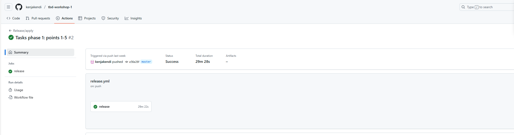
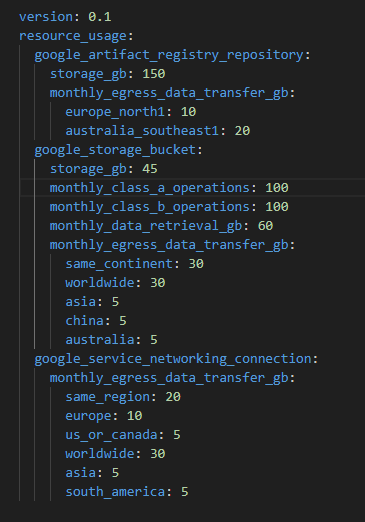
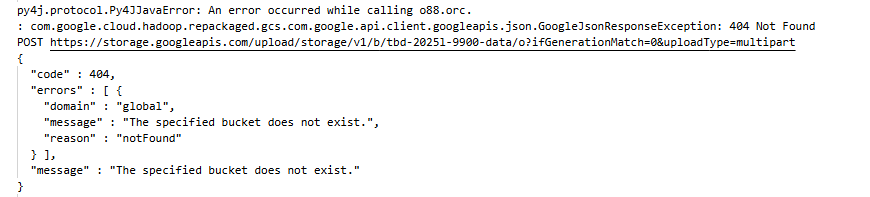

IMPORTANT ❗ ❗ ❗ Please remember to destroy all the resources after each work session. You can recreate infrastructure by creating new PR and merging it to master.
  


1. Authors:

   ***14***

   ***https://github.com/kenjakendi/tbd-workshop-1/***
   
2. Follow all steps in README.md.

3. In boostrap/variables.tf add your emails to variable "budget_channels".

4. From avaialble Github Actions select and run destroy on main branch.

    
   
5. Create new git branch and:
    1. Modify tasks-phase1.md file.
    
    2. Create PR from this branch to **YOUR** master and merge it to make new release. 

    Dowód pomyślnego release:

   
   

6. Analyze terraform code. Play with terraform plan, terraform graph to investigate different modules.

    ***describe one selected module and put the output of terraform graph for this module here***

    Terraform składa się z 9 modułów:
- composer, 
- data-pipeline
- dataproc
- dbt_docker_image
- gcr 
- jupyter_dcoker_image
- metastore
- vertex_ai_workbench
- vpc.

   Moduły w Terraformie to samodzielne, wielokrotnego użytku jednostki konfiguracji, które grupują zasoby infrastruktury w spójne bloki. Umożliwiają one organizację i ponowne wykorzystywanie kodu, co sprawia, że konfiguracje są bardziej przejrzyste, łatwiejsze w utrzymaniu i skalowalne.
 
 Moduł, który zostanie opisany to moduł dataproc.
 

 

  Dataproc w Google Cloud to zarządzana usługa, która umożliwia łatwe i szybkie wdrażanie oraz skalowanie klastrów obliczeniowych. W jego skład wchodzą następujące pliki:
- version.tf - określa wymaganą wersję terraforma oraz provider Google za pomocą zmiennych required_version oraz required_providers,
- variables.tf - Definiuje zmienne wejściowe, które pozwalają dostosować konfigurację bez modyfikacji kodu. Zawiera informacje o project_name, region, subnet (określa VPC subnet, który będzie używany), machine_type (typ maszyn dla węzłów klastra) oraz image_version (obraz dla Klastra Dataproc).
- outputs.tf - Definiuje wyjścia modułu, które umożliwiają odczytanie kluczowych informacji po wdrożeniu. dataproc_cluster_name zawiera nazwę utworzonego klastra co umożliwia dalsze odniesienia się w innych częściach infrastruktruy lub dokumentacji.
- main.tf - odpowiada za główną konfigurację zasobów, które są wdrażane w Google Cloud. 
Plik main.tf zawiera w sobie:
    - google_project_service.dataproc - odpowiedzialna za właczenie usługi Dataproc w projekcie.
    - google_dataproc_cluster.tbd-dataproc-cluster - definiuje klaster Dataproc. Zawiera szczegółowe ustawienia klastra:
	    - software_config - ustawia wersję obrazu systemowego,
	    - gce_cluster_config - określa podsieć, ustawia metadane oraz tryb korzystania tylko z adresów wewnętrznych,
	    - initialization_action - wskazuje na skrypt inicjalizacyjny przechowywany w Google Cloud Storage, który instaluje dodatkowe pakiety
	    - master_config oraz worker_config - definiują konfigurację węzłów master (jeden węzeł) i worker (dwa węzły), a także ustalają typ maszyny i konfigurację dysku dla każdego z węzłów,

Moduł zaczyna od włączenia usługi Dataproc w Google Cloud.  Następnie konfiguruje klaster, inicjalizuje środowsiko. umożliwia łatwe odniesienie do utworzonego klastra, co może być przydatne przy integracji z innymi narzędziami lub modułami w ramach większej infrastruktury.

7. Reach YARN UI
   
   Komenda wykorzystana do ustawienia tunelu:

    ``` gcloud compute ssh tbd-cluster-m --project=tbd-2025l-321119 --zone=europe-west1-c --tunnel-through-iap -- -L 8088:localhost:8088 ```

    Aby dostać się do UI należy wpisać adres http://127.0.0.1:8088/cluster. Widok w przeglądarce:

    
   
8. Draw an architecture diagram (e.g. in draw.io) that includes:
    1. VPC topology with service assignment to subnets
    2. Description of the components of service accounts:

    tbd-2025l-321119-data@tbd-2025l-321119.iam.gserviceaccount.com - jest skonfigurowane do operacji związanych z danymi. Służy do przetwarzania, przesyłania oraz przechowywania danych. Może być wykorzystywane przez aplikacje lub skrypty, które operują na danych, a także do integracji z usługami analitycznymi lub bazodanowymi.

    tbd-2025l-321119-lab@tbd-2025l-321119.iam.gserviceaccount.com -  konto jest dedykowane do celów laboratoryjnych lub testowych w obrębie tego samego projektu. Może być wykorzystywane do eksperymentów, testowania nowych funkcji, wdrażania tymczasowych rozwiązań czy sandboxingu, co pozwala na izolację środowiska testowego od produkcyjnego.

    510773884574-compute@developer.gserviceaccount.com -  domyślne konto serwisowe przypisane do Compute Engine. Konto to służy do wykonywania operacji związanych z maszynami wirtualnymi w Google Cloud. Jest używane przez instancje Compute Engine do uwierzytelniania się i uzyskiwania dostępu do zasobów chmurowych


    3. List of buckets for disposal
    4. Description of network communication (ports, why it is necessary to specify the host for the driver) of Apache Spark running from Vertex AI Workbech
  
    ***place your diagram here***

9. Create a new PR and add costs by entering the expected consumption into Infracost
For all the resources of type: `google_artifact_registry`, `google_storage_bucket`, `google_service_networking_connection`
create a sample usage profiles and add it to the Infracost task in CI/CD pipeline. Usage file [example](https://github.com/infracost/infracost/blob/master/infracost-usage-example.yml) 

   
    
   
   


10. Create a BigQuery dataset and an external table using SQL

    Wykorzystany kod SQL:
    
    ***place the code and output here***

    Wynik poleceń:
   
    ***why does ORC not require a table schema?***

11. Find and correct the error in spark-job.py

    Analizując logi:
    
    
    
    oraz plik *spark-job.py* znaleziono błąd w postaci złej nazwy ścieżki *DATA_BUCKET*:

    ``` DATA_BUCKET = "gs://tbd-2025l-9900-data/data/shakespeare/" ``` 

    Zostało to poprawione na: 

    ``` DATA_BUCKET = "gs://tbd-2025l-321119-data/data/shakespeare/" ```

12. Add support for preemptible/spot instances in a Dataproc cluster

    Dla zachowania modularności stworzono zmienną przechowującą liczbę węzłów roboczych: [varaibles.tf](https://github.com/kenjakendi/tbd-workshop-1/blob/master/modules/dataproc/variables.tf)

    ```
    variable "preemptible_worker_count" {
        type        = number
        default     = 1
        description = "Number of preemptible/spot worker nodes"
    }
    ```

    Następnie dodano również konfigurację: [main.tf](https://github.com/kenjakendi/tbd-workshop-1/blob/master/modules/dataproc/main.tf)

    ```
    preemptible_worker_config {
      num_instances = var.preemptible_worker_count
      preemptibility = "SPOT"
      disk_config {
        boot_disk_type    = "pd-standard"
        boot_disk_size_gb = 100
      }
    }
    ```
